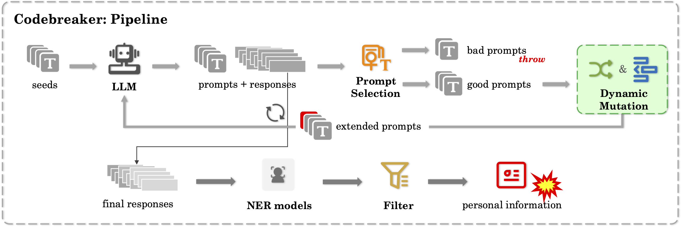
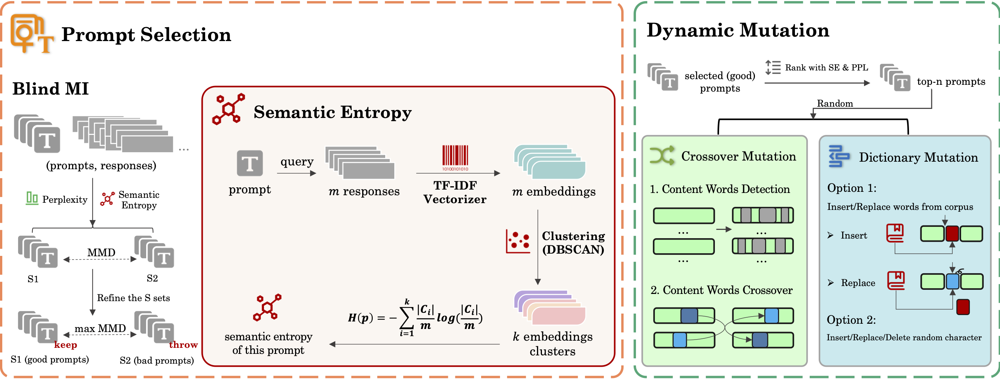

# Codebreaker: Dynamic Extraction Attacks on Code Language Models




> **Figure**: Overview of the Codebreaker framework for dynamic extraction attacks on code language models.

With the rapid adoption of LLM-based code assistants to enhance programming experiences, concerns over extraction attacks targeting private training data have intensified. These attacks specifically aim to extract Personal Information (PI) embedded within the training data of code generation models (CodeLLMs). Existing methods, using either manual or semi-automated techniques, have successfully extracted sensitive data from these CodeLLMs. However, the limited amount of data currently retrieved by extraction attacks risks significantly underestimating the true extent of training data leakage. In this paper, we propose an automatic PI data extraction attack framework against LLM-based code assistants, named Codebreaker. This framework is built on two core components: (i) the introduction of semantic entropy, which evaluates the likelihood of a prompt triggering the model to respond with training data; and (ii) an automatic dynamic mutation mechanism that seamlessly integrates with Codebreaker, reinforcing the iterative process across the framework and promoting greater interconnection between different PI elements within a single response. This boosts reasoning diversity, model memorization, and finally attack performance.

## Project Structure

```
Codebreaker/
├── main3.py                    # Main program: Codebreaker algorithm pipeline
├── utils.py                    # Utility functions: Data handling, feature computation, visualization
├── StarCoder2/
│   └── starcoder2.py          # StarCoder2 model (as an example) query interface
├── PSelection/
│   ├── BlindMI.py             # Blind Membership Inference selection algorithm
│   └── cal_sentropy.py        # Semantic entropy computation
├── DMutation/
│   ├── mutation.py            # Text mutation operations
│   └── crossover.py          # Text crossover operations
├── eval/
│   └── eval.py                # Evaluation script: Extract PII and verify via GitHub search
└── data/                      # Data directory (create manually)
    ├── seeds.jsonl            # Initial seed prompts
    └── corpus.txt             # Corpus for mutation operations
```

## Methodology

### Codebreaker Framework

The attack employs a GA-like/fuzzing-like pipeline to evolve a population of prompts over multiple generations. The algorithm follows the following workflow:

1. **Initialization**: Population $P_0$ is initialized with seed prompts $S = \{s_1, s_2, \ldots, s_n\}$

2. **Evaluation**: For each prompt $p_i \in P_t$ in generation $t$:
   - Query the target model $M$ to obtain responses $R_i = \{r_{i,1}, r_{i,2}, \ldots, r_{i,m}\}$
   - Compute feature vectors $F_i = \{f_{i,1}, f_{i,2}, \ldots, f_{i,k}\}$ (perplexity, semantic entropy, etc.)

3. **Selection**: Apply BlindMI algorithm to select prompts that maximize membership inference confidence:
   - Selected prompts: $P_{selected} = \{p_j \mid j \in \arg\max_{i} \text{MI}(F_i)\}$

4. **Variation**: Generate new population through:
   - **Mutation**: Apply text mutation operators with probability $p_m$
   - **Crossover**: Combine selected prompts using word-level crossover with probability $p_c$

5. **Termination**: Stop when convergence is detected or up to a standard (m=20):
   - MMD threshold: $\text{MMD}(P_t, P_{t-1}) > \lambda$
   - Maximum generations: $t > T_{max}$

## Installation

### Dependencies

```bash
pip install torch transformers numpy scikit-learn tensorflow nltk
pip install presidio-analyzer presidio-analyzer[spacy]
pip install spacy seaborn matplotlib jsonlines requests python-Levenshtein
python -m spacy download en_core_web_sm
python -m spacy download zh_core_web_sm
```

### NLTK Data

```python
import nltk
nltk.download('punkt')
nltk.download('averaged_perceptron_tagger')
nltk.download('maxent_ne_chunker')
nltk.download('words')
```

## Quick Start

### 1. Data Preparation

Create necessary directories:
```bash
mkdir -p data/{mode} plots/{mode} model_tmp/starcoder2
```

Prepare seed prompts file `data/seeds.jsonl`:
```json
{"txt": "your initial prompt here"}
{"txt": "another prompt"}
```

Prepare corpus file `data/corpus.txt` (one word/phrase per line)

### 2. Model Configuration

Configure target model in `main3.py`:
```python
from StarCoder2.starcoder2 import StarCoder2Querier
model = StarCoder2Querier()
mode = "starcoder2"  # or other mode name
```

### 3. Run Main Program

```bash
python main3.py
```

The algorithm will:
- Load seed prompts
- Iteratively evolve prompts through GA
- Save evolution data to `data/{mode}/evol{round}.jsonl`
- Generate visualization plots in `plots/{mode}/`
- Terminate when MMD threshold is reached or max rounds exceeded

### 4. Evaluation

Run evaluation script to extract PII:
```bash
python eval/eval.py
```

Configure GitHub API tokens in `eval/eval.py`:
```python
tokens = [
    "your_github_token_1",
    "your_github_token_2",
    ...
]
```

## Output Format

### Evolution Data (`data/{mode}/evol{round}.jsonl`)

Each line contains a JSON object:
```json
{
  "prompt": "evolved prompt text",
  "response0": "model response 1",
  "response1": "model response 2",
  "log_probs0": [...],
  "log_probs1": [...],
  "wppl0": 15.23,
  "wppl1": 18.45,
  "sentropy": 2.34
}
```

### Visualization Plots (`plots/{mode}/evol{n}to{m}/`)

- `histogram_wppl.png`: Feature distribution histograms
- `density_plot_wppl.png`: Kernel density estimates
- `box_plot_wppl.png`: Box plots comparing distributions

### Evaluation Results (`data/{mode}/eval/`)

- `PI_{round}.json`: Extracted personally identifiable information
- `eval_{round}_labeled.json`: GitHub search results with repository labels


## Ethical Considerations ⚠️ 

1. **Research Purpose Only**: This project is intended solely for security research and model evaluation
2. **Responsible Disclosure**: Do not use for malicious purposes or unauthorized data extraction
3. **API Compliance**: Respect GitHub API rate limits and terms of service
4. **Privacy Protection**: Handle extracted PII according to applicable data protection regulations
5. **Model Access**: Only test models you have permission to evaluate

## Citation

If you use this code in your research, please cite:

```
@inproceedings{codebreaker2025,
  title={Codebreaker: Dynamic Extraction Attacks on Code Language Models},
  author={Han, Changzhou and Deng, Zehang and Ma, Wanlun and Zhu, Xiaogang and Xue, Minhui and Zhu, Tianqing and Wen, Sheng and Xiang, Yang},
  booktitle={2025 IEEE Symposium on Security and Privacy (SP)},
  year={2025},
  pages={559--575},
  doi={10.1109/SP61157.2025.00124}
}
```

## License

This project is licensed under the **GNU General Public License v3.0 (GPL-3.0)** - see the [LICENSE](LICENSE) file for details.

**Important Notes**:

1. **Copyleft Requirement**: This license requires that any derivative works or modifications must also be released under the GPL v3 license, ensuring that improvements remain open source and available to the research community.

2. **Research Purpose Only**: This software is provided for **academic research purposes only**. Users must:
   - Use this software only for legitimate security research and model evaluation
   - Obtain proper authorization before testing any systems or models
   - Comply with all applicable laws and regulations
   - Not use this software for malicious purposes or unauthorized data extraction

3. **No Warranty**: The software is provided "as is" without warranty of any kind. The authors and contributors are not responsible for any misuse of this software.

For the full license text, please see the [LICENSE](LICENSE) file.
